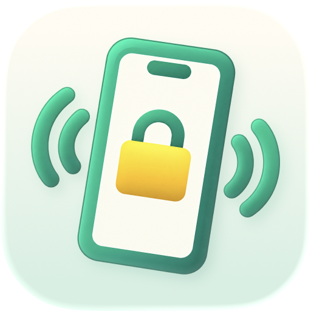
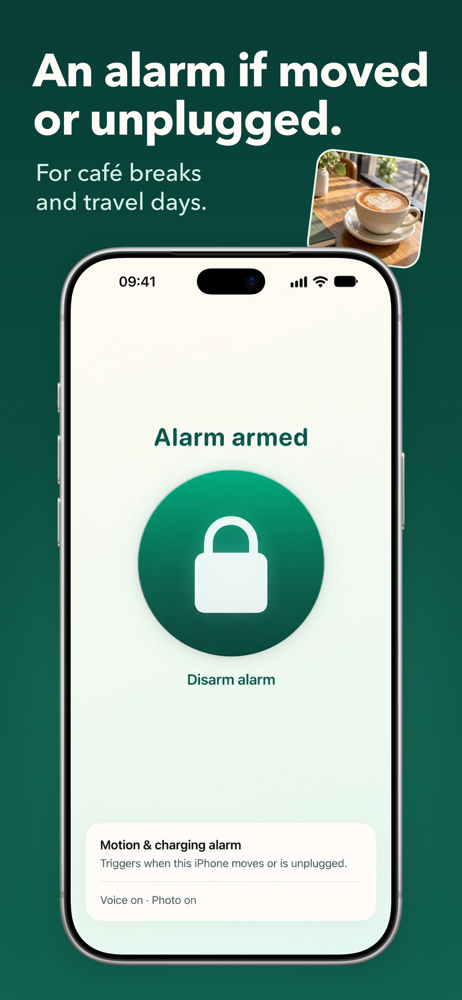
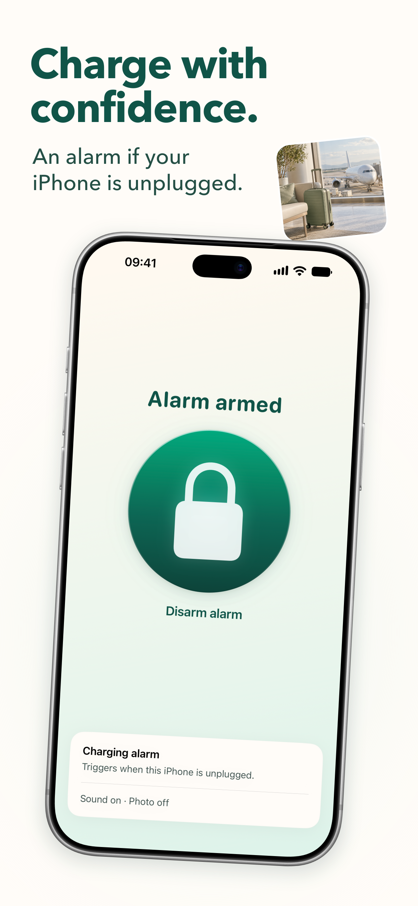
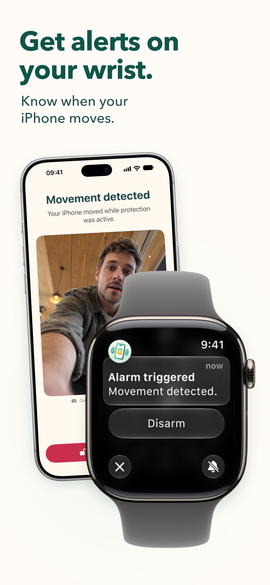

# MoveAlert

**An alarm if your iPhone or iPad is moved or unplugged.**

Arm your device while you charge at an airport, work at a café, or keep it nearby. MoveAlert detects movement or disconnection from power and alerts you with your chosen sound, a spoken message, or an alert on your paired Apple Watch.

MoveAlert is the new name for **LocationLock** in version 2.0. The screenshots below show the refreshed design. This repository is the public home for app information, support, and our privacy policy.

[Download on the App Store](https://apps.apple.com/app/id6748995958) · [Get support](https://github.com/superturboryan/LocationLock/discussions) · [Privacy policy](PRIVACY.md)

  
  
  

## How it works

1. Choose **Motion**, **Charging**, or **Both** in Settings. Connect your device to power before arming a charging alarm.
2. Choose your sound and any optional features, then tap **Arm alarm**.
3. MoveAlert triggers when it detects movement or disconnection from power, according to your chosen mode.
4. Tap **Disarm alarm**, or use your paired Apple Watch. Any authentication requirements you enabled still apply.

## Features

- **Motion and charging alarms:** adjustable motion sensitivity, wired and wireless charging detection, and optional automatic arming when connected to power.
- **Apple Watch companion:** arm or disarm your iPhone, check its status, and receive alarm alerts with haptics. Watch communication depends on connectivity between your devices.
- **Your choice of alarm:** built-in sounds, a custom text-to-speech message, or silent alarm audio with Watch alerts. Optional Max Volume restores your previous volume when alarm playback stops.
- **Optional alarm photo:** capture a single photo when the alarm triggers, with your permission. Choose whether to save it to Photos or send it to your paired Watch. Keep MoveAlert open on-screen for camera capture.
- **Disarming options:** optionally require Face ID, Touch ID, or your Apple Watch to turn off the alarm.
- **Arming countdown:** give yourself time to put the device down before monitoring begins.
- **Shortcuts and controls:** arm, disarm, toggle, or check alarm status through Shortcuts and Siri, with a Control Center toggle for quick access.
- **iPhone, iPad, and Apple Watch:** version 2.0 includes English, German, French, Italian, and Spanish.

Some features require **MoveAlert Pro**, a one-time purchase with lifetime access to Pro features. There is no subscription. See the upgrade screen for features and your local price. Existing LocationLock Pro purchases continue to apply; use **Settings → Restore Purchases** with the Apple Account used for the original purchase if needed.

## Privacy

Core alarm monitoring runs on your device. MoveAlert does not require an account, track your location, show ads, or use third-party analytics. Photos are optional, and alarm data is not uploaded to a developer-operated server.

Our [privacy policy](PRIVACY.md) explains local storage, photo and Watch features, purchases, diagnostics, and your choices.

## Tips

- Try your chosen settings before relying on an alarm. Sound output depends on your volume settings and connected audio devices; Watch alerts depend on connectivity and notification settings.
- Use a lower motion sensitivity if a moving surface triggers unwanted alarms.
- MoveAlert is an awareness tool and theft deterrent. It cannot guarantee that a device will not be taken and does not replace your device passcode or Find My.

## Earlier demos

These videos show an earlier version under the LocationLock name. The interface has changed in MoveAlert 2.0.

- [Earlier demo 1](https://www.youtube.com/shorts/DSdw_-l8kuc)
- [Earlier demo 2](https://www.youtube.com/shorts/gM4ih2oXbB8)

## Support

- Open **Settings → Help** in the app for setup instructions and troubleshooting.
- Browse [community discussions](https://github.com/superturboryan/LocationLock/discussions) or [start a discussion](https://github.com/superturboryan/LocationLock/discussions/new/choose).
- Email [watchcloud.app@gmail.com](mailto:watchcloud.app@gmail.com) for help or privacy questions.

For a bug report, include your device model, operating system version, app version, and steps to reproduce the issue. Please avoid posting personal information or private photos in public discussions.
